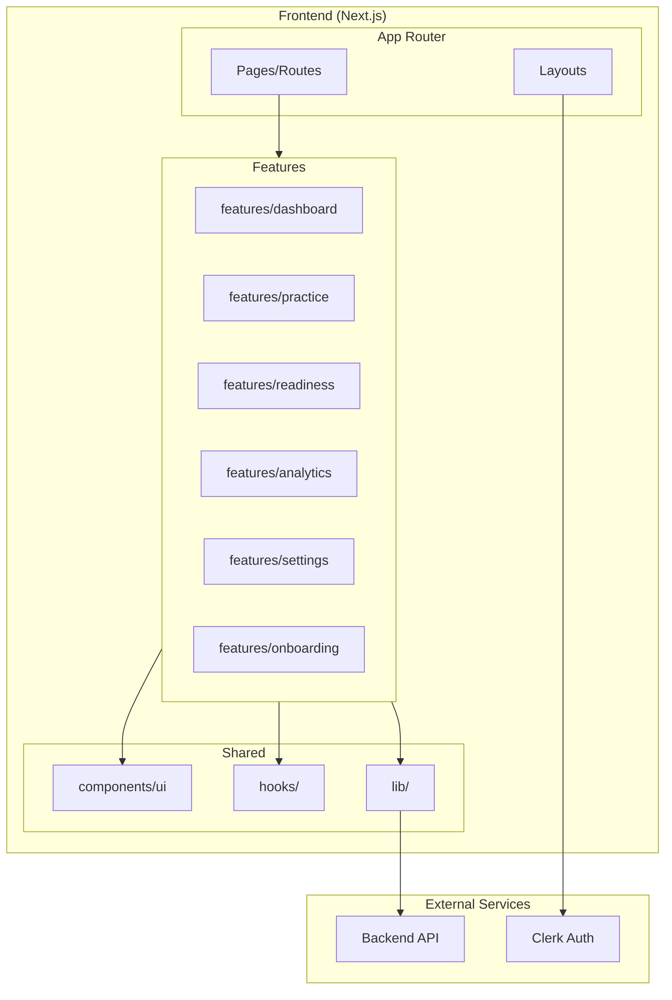

# Design Document

## Overview

This design document outlines the architecture and implementation approach for the Genta frontend UI. The system is a Next.js application that provides an adaptive UTBK preparation platform with real-time AI feedback, readiness tracking, and progress analytics.

The frontend communicates with a Go backend via ts-rest, uses Clerk for authentication, and follows a feature-based folder structure with shadcn/ui components.

## Architecture



### Technology Stack

| Layer          | Technology                | Purpose                          |
| -------------- | ------------------------- | -------------------------------- |
| Framework      | Next.js 15 (App Router)   | Server/client rendering, routing |
| UI Components  | shadcn/ui + Tailwind CSS  | Clean, minimalist design         |
| API Client     | ts-rest                   | Type-safe API communication      |
| Authentication | Clerk                     | User auth, session management    |
| Charts         | Recharts                  | Analytics visualizations         |
| Forms          | React Hook Form + Zod     | Form validation                  |
| Animation      | Framer Motion             | Smooth transitions               |
| State          | React Query (via ts-rest) | Server state caching             |

## Components and Interfaces

### Feature Module Structure

Each feature follows this structure:

```
features/[feature-name]/
├── components/
│   ├── component-name.tsx
│   └── index.ts
├── hooks/
│   └── use-feature-hook.ts
├── types/
│   └── index.ts
├── mock/
│   └── mock-data.ts
└── index.ts
```

### Key Components by Feature

#### Onboarding Feature (`features/onboarding/`)

- `onboarding-form.tsx` - Multi-step form component
- `step-indicator.tsx` - Progress indicator
- `ptn-selector.tsx` - University selection dropdown
- `score-slider.tsx` - Target score range slider
- `date-picker.tsx` - Exam date picker

#### Dashboard Feature (`features/dashboard/`)

- `navbar.tsx` - Top navigation bar
- `welcome-header.tsx` - Greeting with streak/progress
- `quick-actions.tsx` - Practice session buttons
- `tps-readiness-card.tsx` - TPS subtests overview
- `literasi-readiness-card.tsx` - Literasi subtests overview
- `overall-readiness-card.tsx` - Combined readiness score
- `activity-heatmap.tsx` - GitHub-style activity grid
- `countdown-banner.tsx` - Days until exam
- `stats-activity-card.tsx` - Combined stats and activity

#### Practice Feature (`features/practice/`)

- `session-header.tsx` - Timer, progress, section badge
- `question-card.tsx` - Question text display
- `answer-options.tsx` - Radio button options A-E
- `submit-button.tsx` - Answer submission
- `result-display.tsx` - Correct/incorrect feedback
- `feedback-panel.tsx` - AI feedback with rating
- `session-summary.tsx` - End of session stats

#### Readiness Feature (`features/readiness/`)

- `readiness-header.tsx` - Section title and category
- `metrics-grid.tsx` - Accuracy, readiness, score cards
- `theta-gauge.tsx` - Current vs target visualization
- `accuracy-trend-chart.tsx` - 30-day line chart
- `subtype-breakdown.tsx` - Question type accuracy
- `next-steps-card.tsx` - Recommendations

#### Analytics Feature (`features/analytics/`)

- `time-range-filter.tsx` - Period selector tabs
- `overview-cards.tsx` - Summary statistics
- `accuracy-trend-chart.tsx` - Line chart
- `section-comparison-chart.tsx` - Bar chart
- `performance-table.tsx` - Sortable metrics table

#### Settings Feature (`features/settings/`)

- `profile-section.tsx` - Avatar, name, email
- `goals-section.tsx` - Academic targets
- `preferences-section.tsx` - Theme, language
- `subscription-section.tsx` - Plan status

### API Integration Hooks

```typescript
// features/dashboard/hooks/use-readiness.ts
export function useReadiness() {
  const api = useApiClient();
  return useQuery({
    queryKey: ["readiness"],
    queryFn: () => api.getReadinessOverview(),
  });
}

// features/practice/hooks/use-session.ts
export function useSession(section: Section) {
  const api = useApiClient();
  return useMutation({
    mutationFn: () => api.createSession({ body: { section } }),
  });
}

// features/practice/hooks/use-next-question.ts
export function useNextQuestion(section: Section) {
  const api = useApiClient();
  return useQuery({
    queryKey: ["nextQuestion", section],
    queryFn: () => api.getNextQuestion({ query: { section } }),
  });
}
```

## Data Models

### Core Types (from API)

```typescript
// Section enum
type Section = "PU" | "PPU" | "PBM" | "PK" | "LBI" | "LBE" | "PM";

// Answer enum
type Answer = "A" | "B" | "C" | "D" | "E";

// User profile
interface User {
  id: string;
  clerkId: string;
  email: string;
  fullName: string | null;
  avatarUrl: string | null;
  subscriptionTier: string;
  targetPtn: string | null;
  targetScore: number | null;
  examDate: string | null;
  studyHoursPerWeek: number | null;
  onboardingCompleted: boolean;
  irtTheta: number | null;
}

// Readiness data
interface SectionReadiness {
  section: Section;
  overallAccuracy: number;
  recentAccuracy: number;
  readinessPercentage: number;
  currentTheta: number;
  targetTheta: number;
  predictedScoreLow: number;
  predictedScoreHigh: number;
  daysToReady: number | null;
  totalAttempts: number;
  totalCorrect: number;
}

// Question
interface Question {
  id: string;
  section: Section;
  subType: string | null;
  text: string;
  options: [string, string, string, string, string];
  difficultyIrt: number | null;
}

// Attempt
interface Attempt {
  id: string;
  questionId: string;
  selectedAnswer: Answer;
  isCorrect: boolean;
  timeSpentSeconds: number;
  thetaChange: number | null;
  feedback?: Feedback;
}

// Session
interface Session {
  id: string;
  startedAt: string;
  endedAt: string | null;
  questionsAttempted: number;
  questionsCorrect: number;
  accuracyInSession: number | null;
  section: Section | null;
}
```

### UI State Types

```typescript
// Onboarding form state
interface OnboardingFormData {
  targetPtn: string;
  targetScore: number;
  examDate: Date;
  studyHoursPerWeek: number;
}

// Practice session state
interface PracticeSessionState {
  sessionId: string | null;
  currentQuestion: Question | null;
  selectedAnswer: Answer | null;
  timeElapsed: number;
  isSubmitting: boolean;
  showResult: boolean;
  feedback: Feedback | null;
  feedbackLoading: boolean;
}

// Theme preference
type Theme = "light" | "dark" | "system";
```

## Correctness Properties

_A property is a characteristic or behavior that should hold true across all valid executions of a system-essentially, a formal statement about what the system should do. Properties serve as the bridge between human-readable specifications and machine-verifiable correctness guarantees._

Based on the prework analysis, the following properties can be tested:

### Property 1: Onboarding redirect for incomplete users

_For any_ user with `onboarding_completed: false`, accessing the dashboard should result in a redirect to the onboarding page.
**Validates: Requirements 1.1**

### Property 2: Valid onboarding data submission

_For any_ valid onboarding form data (valid PTN, score 550-750, future date, hours 1-168), submitting should call the API with correct parameters and redirect to dashboard.
**Validates: Requirements 1.3**

### Property 3: Invalid onboarding data rejection

_For any_ invalid onboarding form data (empty PTN, score out of range, past date, invalid hours), submitting should display field-level validation errors without calling the API.
**Validates: Requirements 1.4**

### Property 4: Welcome header displays user data

_For any_ user profile data, the welcome header should display the user's name, daily progress, and streak count correctly.
**Validates: Requirements 2.1**

### Property 5: Countdown calculation accuracy

_For any_ exam date in the future, the countdown banner should display the correct number of days remaining.
**Validates: Requirements 2.8**

### Property 6: Question fetch with correct section

_For any_ selected section (PU, PPU, PBM, PK, LBI, LBE, PM), starting a session should call GET /api/v1/questions/next with that section parameter.
**Validates: Requirements 3.2**

### Property 7: Attempt submission with correct data

_For any_ answer selection (A-E) and time spent, submitting should call POST /api/v1/attempts with question_id, selected_answer, time_spent_seconds, and session_id.
**Validates: Requirements 3.4**

### Property 8: Result display matches API response

_For any_ attempt response with is_correct true/false, the UI should display the correct result and highlight the correct answer.
**Validates: Requirements 3.5**

### Property 9: Feedback rating submission

_For any_ feedback rating (thumbs up/down), clicking should call PUT /api/v1/attempts/:attempt_id/feedback-rating with is_helpful true/false.
**Validates: Requirements 3.9**

### Property 10: Readiness page fetches correct section

_For any_ section route parameter, the readiness detail page should call GET /api/v1/readiness/:section with that section.
**Validates: Requirements 4.1**

### Property 11: Subtype breakdown displays all types

_For any_ section readiness data with subtype_breakdown, all subtypes should be displayed with their accuracy percentages.
**Validates: Requirements 4.5**

### Property 12: Days to ready calculation

_For any_ readiness data with days_to_ready, the countdown should display the correct number of days and estimated completion date.
**Validates: Requirements 4.6**

### Property 13: Conditional recommendation display (below 75%)

_For any_ readiness percentage below 75%, the UI should display recommended daily practice target.
**Validates: Requirements 4.7**

### Property 14: Conditional congratulations display (75%+)

_For any_ readiness percentage of 75% or above, the UI should display a congratulations message.
**Validates: Requirements 4.8**

### Property 15: Analytics API call with days parameter

_For any_ days filter value (7, 30, 90, etc.), the analytics page should call GET /api/v1/analytics/progress with that days parameter.
**Validates: Requirements 5.1**

### Property 16: Section comparison chart completeness

_For any_ analytics data, the section comparison chart should display all 7 subtests (PU, PPU, PBM, PK, LBI, LBE, PM).
**Validates: Requirements 5.4**

### Property 17: Time range filter refetch

_For any_ time range filter change, the system should refetch data with the new days parameter.
**Validates: Requirements 5.6**

### Property 18: Profile update submission

_For any_ profile field update, saving should call PUT /api/v1/users/me with the updated data.
**Validates: Requirements 6.2**

### Property 19: Theme persistence

_For any_ theme selection (light/dark/system), the theme should be applied immediately and persisted to localStorage.
**Validates: Requirements 6.4, 6.5**

### Property 20: 401 error redirect

_For any_ API call that returns 401, the system should redirect to the sign-in page.
**Validates: Requirements 7.2**

### Property 21: 400 error field display

_For any_ API call that returns 400 with field errors, the system should display errors for each specified field.
**Validates: Requirements 7.3**

### Property 22: Error handling consistency

_For any_ API error response, the system should handle it using the consistent error response structure (code, message, status, errors).
**Validates: Requirements 9.4**

## Error Handling

### API Error Handling Strategy

```typescript
// lib/api/error-handler.ts
export function handleApiError(error: ApiError, router: Router) {
  switch (error.status) {
    case 401:
      router.push("/sign-in");
      break;
    case 400:
      return { fieldErrors: error.errors };
    case 429:
      toast.error(`Rate limited. Retry in ${error.action?.value}s`);
      break;
    case 500:
    case 503:
      toast.error("Something went wrong. Please try again.");
      break;
  }
}
```

### Loading States

- Skeleton loaders for cards and lists
- Spinner for button submissions
- Progress indicator for multi-step forms
- Polling indicator for feedback generation

### Empty States

- No practice history: "Start your first practice session"
- No readiness data: "Complete some questions to see your readiness"
- No analytics: "Practice more to see your progress"

## Testing Strategy

### Dual Testing Approach

The testing strategy combines unit tests for specific examples and property-based tests for universal properties.

### Property-Based Testing Library

**Library:** fast-check (TypeScript property-based testing)

**Configuration:**

- Minimum 100 iterations per property test
- Seed logging for reproducibility
- Shrinking enabled for minimal failing examples

### Test File Organization

```
features/[feature]/
├── components/
│   ├── component.tsx
│   └── component.test.tsx
├── hooks/
│   ├── use-hook.ts
│   └── use-hook.test.ts
└── __tests__/
    └── properties.test.ts  # Property-based tests
```

### Unit Tests

Unit tests cover:

- Component rendering with various props
- Hook behavior with mocked API responses
- Form validation logic
- Utility function edge cases

### Property-Based Tests

Property tests verify:

- Form validation accepts all valid inputs
- Form validation rejects all invalid inputs
- API calls include correct parameters
- UI state matches API response data
- Conditional rendering based on data thresholds

### Test Annotation Format

Each property-based test must include:

```typescript
/**
 * Feature: frontend-ui-implementation, Property 1: Onboarding redirect for incomplete users
 * Validates: Requirements 1.1
 */
```
